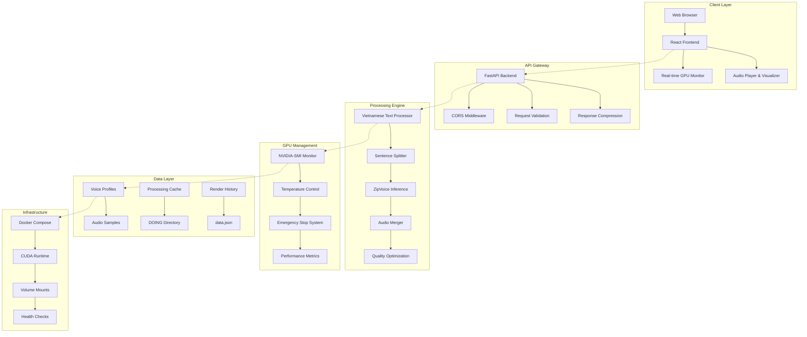

# 🎤 Premium Vietnamese Text-to-Speech Application (ZipVoice) - Version 2.0

[](https://vi.wikipedia.org/wiki/Ti%E1%BA%BFng_Vi%E1%BB%87t)
[](https://github.com/k2-fsa/ZipVoice)
[](https://www.docker.com/)
[](https://reactjs.org/)
[](https://fastapi.tiangolo.com/)
[](https://developer.nvidia.com/cuda-toolkit)
[](https://github.com/Clarence161095/Premium-Vietnamese-Text-to-Speech-Application)

> **🇻🇳 Ứng dụng Text-to-Speech tiếng Việt đẳng cấp quốc tế** với công nghệ ZipVoice Flow Matching tiên tiến nhất hiện nay. Hỗ trợ đầy đủ âm điệu, dấu thanh và phát âm chuẩn tiếng Việt. **Version 2.0** với kiến trúc enterprise-grade: GPU monitoring, thermal protection, emergency controls và sentence-by-sentence processing cho hiệu năng tối ưu.

## 🌟 **Tính Năng Nổi Bật**

### 🎯 **Chất Lượng Âm Thanh Vượt Trội**

- **ZipVoice Flow Matching**: Công nghệ AI tiên tiến cho chất lượng âm thanh tự nhiên
- **Hỗ trợ đầy đủ tiếng Việt**: Âm điệu, dấu thanh, và phát âm chuẩn 
- **eSpeak Tokenizer**: Xử lý chính xác ngữ âm tiếng Việt (vi language)
- **Xử lý câu theo câu**: Chia văn bản thành câu riêng lẻ để tối ưu hiệu năng
- **Audio 24kHz**: Chất lượng âm thanh professional với mono PCM 16-bit
- **Vietnamese Model**: Model đã được train đặc biệt cho tiếng Việt (iter-525000-avg-2.pt)

### ⚡ **Hiệu Năng Tối Ưu & An Toàn**

- **Sentence-Based Processing**: Xử lý từng câu riêng biệt trong thư mục `/DOING`
- **GPU Monitoring**: Giám sát nhiệt độ, sử dụng GPU và VRAM thời gian thực
- **Bảo vệ nhiệt**: Tự động dừng khi nhiệt độ GPU > 90°C, giảm tải khi > 85°C
- **Emergency Stop**: Nút dừng khẩn cấp cho quá trình xử lý
- **Performance Metrics**: Theo dõi hiệu năng với dữ liệu 1000 lần render gần nhất
- **Automatic Cleanup**: Tự động xóa file tạm sau 8 giờ
- **Error Recovery**: Xử lý lỗi graceful và recovery tự động

### 🎨 **Giao Diện Người Dùng Hiện Đại**

- **Thiết kế Ergonomic**: Hệ thống màu GitHub-style cho mắt
- **Dark/Light Mode**: Chế độ tối/sáng với chuyển đổi mượt mà
- **Responsive Design**: Hoạt động tốt trên mọi thiết bị
- **Audio Visualizer**: Hiệu ứng sóng âm thanh chuyên nghiệp
- **Tooltip Premium**: Hệ thống tooltip với glass effect
- **Real-Time Monitoring**: Hiển thị trạng thái GPU và tiến trình xử lý
- **Vietnamese Interface**: Giao diện hoàn toàn tiếng Việt với UX tối ưu

### 🔧 **Đơn Giản Hóa Phiên Bản 2.0**

- **Loại bỏ cài đặt nâng cao**: Sử dụng mặc định ZipVoice đã được chứng minh
- **Không giới hạn token**: Xử lý văn bản bất kỳ độ dài nhờ xử lý câu theo câu
- **Tập trung vào Profile Giọng Nói**: Giao diện quản lý profile sạch sẽ, chuyên nghiệp
- **Mặc định thông minh**: Tự động sử dụng profile "tina" khi không chọn
- **One-Click Default**: Nút sử dụng giọng mặc định ngay lập tức

### 🔐 **Enterprise-Grade Security & Reliability**

- **Docker Security**: Containerized với resource limits và security contexts
- **GPU Resource Management**: Quản lý CUDA memory và process isolation
- **Data Persistence**: Volume mounts bảo vệ dữ liệu profiles và models
- **Health Checks**: Monitoring và auto-restart containers khi cần
- **Backup & Recovery**: Automatic backup cho voice profiles và settings

## 🏗️ **Kiến Trúc Hệ Thống Chi Tiết**



### 🔧 **Component Architecture (Version 2.0)**

```typescript
┌─────────────────────────────────────────────────────────────┐
│               Premium Vietnamese TTS v2.0                   │
├─────────────────────────────────────────────────────────────┤
│  Frontend (React + Vite)     │  Backend (FastAPI)          │
│  ├─ Bilingual UI (VI/EN)     │  ├─ Vietnamese Optimization │
│  ├─ Voice Profile Focus      │  ├─ Sentence Processing     │
│  ├─ Real-Time GPU Monitor    │  ├─ GPU Safety Controls     │
│  ├─ Emergency Stop           │  └─ Performance Tracking    │
│  └─ Simplified UX            │                             │
├─────────────────────────────────────────────────────────────┤
│              ZipVoice Core (Flow Matching TTS)              │
│  ├─ Model: iter-525000-avg-2.pt (491MB Vietnamese)        │
│  ├─ Tokenizer: eSpeak (vi language)                       │
│  ├─ Audio: 24kHz mono conversion                          │
│  └─ Sentence-based processing với timeout 60s             │
├─────────────────────────────────────────────────────────────┤
│              Docker Infrastructure                          │
│  ├─ Backend: nvidia/cuda:12.1.0 + PyTorch CUDA           │
│  ├─ Frontend: Node.js + Vite development                  │
│  └─ Data: Voice profiles & /DOING processing folder       │
└─────────────────────────────────────────────────────────────┘
```

### 📊 **Data Flow Architecture**

```python
# Luồng xử lý hoàn chỉnh từ Text → Audio
def vietnamese_tts_pipeline(text: str, profile_id: str = "tina"):
    """
    Pipeline xử lý TTS tiếng Việt hoàn chỉnh
    """
    # 1. Text Preprocessing & Validation
    cleaned_text = preprocess_vietnamese_text(text)
    sentences = split_vietnamese_sentences(cleaned_text)
    
    # 2. GPU Safety Check
    gpu_status = get_gpu_status()
    if gpu_status.temperature >= GPU_TEMP_EMERGENCY:
        raise GPUOverheatException("GPU quá nóng, dừng xử lý")
    
    # 3. Profile Loading
    profile_data = load_voice_profile(profile_id)
    
    # 4. Sentence-by-Sentence Processing
    doing_dir = f"/DOING/{timestamp}"
    audio_segments = []
    
    for i, sentence in enumerate(sentences):
        # Check stop signal
        if should_stop_processing():
            cleanup_and_exit(doing_dir)
            return None
            
        # Process individual sentence
        segment_path = f"{doing_dir}/seg_{i:03d}.wav"
        process_single_sentence(
            sentence=sentence,
            profile=profile_data,
            output_path=segment_path,
            timeout=60  # seconds
        )
        audio_segments.append(segment_path)
    
    # 5. Audio Merging with Natural Pauses
    final_audio = merge_audio_segments(
        segments=audio_segments,
        pause_duration=0.5  # 0.5s between sentences
    )
    
    # 6. Quality Optimization & Cleanup
    optimized_audio = optimize_audio_quality(final_audio)
    cleanup_temporary_files(doing_dir, delay_hours=8)
    
    # 7. Performance Metrics Update
    render_metrics.add_render(
        word_count=count_vietnamese_words(text),
        render_time=processing_time
    )
    
    return optimized_audio
```

## 🚀 **Cài Đặt và Chạy**

## 🚀 **Cài Đặt và Triển Khai Chi Tiết**

### 📋 **Yêu Cầu Hệ Thống**

#### **Phần Cứng Tối Thiểu:**

- **GPU**: NVIDIA GPU với CUDA Compute Capability ≥ 6.0
- **VRAM**: 6GB+ (khuyến nghị 8GB+)
- **RAM**: 8GB+ (khuyến nghị 16GB+)
- **Storage**: 10GB+ dung lượng trống
- **CPU**: 4 cores+ (Intel i5/AMD Ryzen 5 trở lên)

#### **Phần Mềm:**

- **Docker**: 20.10+ với Docker Compose
- **NVIDIA Container Toolkit**: Để hỗ trợ GPU
- **Git**: Để clone repository
- **CUDA Driver**: 12.1+ compatible

#### **Hệ Điều Hành Được Hỗ Trợ:**

- **Linux**: Ubuntu 20.04+, CentOS 8+, RHEL 8+
- **Windows**: Windows 10/11 với WSL2 và Docker Desktop
- **macOS**: macOS 12+ với Docker Desktop (CPU only)

### ⚙️ **Cài Đặt Step-by-Step**

#### **Bước 1: Chuẩn Bị Môi Trường**

```bash
# Kiểm tra CUDA và GPU
nvidia-smi

# Kiểm tra Docker
docker --version
docker compose version

# Kiểm tra NVIDIA Container Toolkit
docker run --rm --gpus all nvidia/cuda:12.1-base-ubuntu20.04 nvidia-smi
```

#### **Bước 2: Clone Repository & Setup**

```bash
# Clone repository
git clone https://github.com/Clarence161095/Premium-Vietnamese-Text-to-Speech-Application.git
cd Premium-Vietnamese-Text-to-Speech-Application

# Tải ZipVoice submodule
git submodule update --init --recursive

# Kiểm tra cấu trúc
ls -la
```

#### **Bước 3: Cấu Hình Environment Variables**

```bash
# Tạo file .env (tuỳ chọn)
cat > .env << EOF
CUDA_VISIBLE_DEVICES=0
NVIDIA_VISIBLE_DEVICES=all
NVIDIA_DRIVER_CAPABILITIES=compute,utility
GPU_MEMORY_FRACTION=0.9
PYTHONPATH=/ZipVoice:/app
DEFAULT_PROFILE=tina
EOF
```

#### **Bước 4: Build và Deploy**

```bash
# Build images
docker compose build

# Deploy với GPU support
docker compose up -d

# Kiểm tra logs
docker compose logs -f
```

#### **Bước 5: Verification**

```bash
# Test backend API
curl http://localhost:8000/health

# Test GPU status
curl http://localhost:8000/gpu_status | jq

# Test frontend
curl -I http://localhost:3000
```

### 🔧 **Cấu Hình Nâng Cao**

#### **GPU Optimization**

```yaml
# docker-compose.yml - GPU Configuration
services:
  backend:
    deploy:
      resources:
        reservations:
          devices:
            - driver: nvidia
              count: 1
              capabilities: [gpu]
    environment:
      - CUDA_MEMORY_FRACTION=0.9
      - GPU_TEMP_EMERGENCY=90
      - GPU_TEMP_THROTTLE=85
```

#### **Performance Tuning**

```python
# backend/config.py - Performance Settings
PERFORMANCE_CONFIG = {
    "max_concurrent_renders": 1,
    "sentence_timeout": 60,
    "cleanup_interval_hours": 8,
    "metrics_retention": 1000,
    "gpu_monitor_interval": 5
}
```

#### **Security Configuration**

```yaml
# docker-compose.yml - Security Settings
services:
  backend:
    security_opt:
      - no-new-privileges:true
    read_only: false
    tmpfs:
      - /tmp:rw,noexec,nosuid,size=1g
    cap_drop:
      - ALL
    cap_add:
      - DAC_OVERRIDE
```

### 🌐 **Truy Cập Ứng Dụng**

- **Frontend**: [http://localhost:3000](http://localhost:3000)
- **Backend API**: [http://localhost:8000](http://localhost:8000)
- **API Docs**: [http://localhost:8000/docs](http://localhost:8000/docs)
- **GPU Status**: [http://localhost:8000/gpu_status](http://localhost:8000/gpu_status)
- **Health Check**: [http://localhost:8000/health](http://localhost:8000/health)

## 📖 **Hướng Dẫn Sử Dụng**

### 🎵 **Tạo Giọng Nói Cơ Bản**

1. **Nhập văn bản**: Gõ văn bản tiếng Việt vào ô "Nhập văn bản"
2. **Chọn giọng**: Sử dụng giọng mặc định hoặc tạo profile tùy chỉnh
3. **Tạo giọng**: Click "Tạo giọng nói" và chờ xử lý
4. **Tải xuống**: Click "Tải xuống" để lưu file WAV

### 👤 **Quản Lý Profile Giọng Nói**

1. **Tạo Profile Mới**:
   - Click "Thêm profile mới"
   - Nhập tên và mô tả
   - Upload file audio mẫu (WAV/MP3)
   - Nhập transcript tương ứng
   - Click "Tạo profile"

2. **Sử dụng Profile**:
   - Chọn profile từ danh sách
   - Hoặc sử dụng giọng mặc định (Tina)

### ⚡ **Giám Sát Thời Gian Thực**

- **GPU Status**: Theo dõi nhiệt độ, sử dụng GPU và VRAM mỗi 5 giây
- **Render Progress**: Xem tiến trình xử lý và thời gian ước tính
- **Emergency Stop**: Nút dừng khẩn cấp khi cần thiết
- **Performance Metrics**: Xem thống kê hiệu năng từ 1000 lần render gần nhất

## 🔧 **Phát Triển và Tùy Chỉnh**

### 📁 **Cấu Trúc Thư Mục**

```
Premium-Vietnamese-TTS/
├── 📁 backend/                 # FastAPI Backend
│   ├── main.py                # API chính
│   ├── requirements.txt       # Dependencies Python
│   └── Dockerfile            # Docker config
├── 📁 frontend/               # React Frontend  
│   ├── src/
│   │   ├── App.jsx           # Component chính
│   │   ├── App.css           # Styles chính
│   │   └── index.js          # Entry point
│   ├── package.json          # Dependencies Node.js
│   └── Dockerfile            # Docker config
├── 📁 data/                   # Voice Profiles
│   ├── tina/                 # Profile mặc định
│   └── [custom-profiles]/    # Profiles tùy chỉnh
├── 📁 ZipVoice/              # ZipVoice Submodule
│   ├── zipvoice/             # Core TTS engine
│   └── assets/               # Model files
├── docker-compose.yml         # Container orchestration
├── README.md                 # Tài liệu này
└── docs/                     # Tài liệu chi tiết
```

### 🐳 **Docker Development**

```bash
# Chạy trong development mode
docker compose up --build

# Xem logs chi tiết
docker compose logs backend
docker compose logs frontend

# Restart services
docker compose restart backend
docker compose restart frontend

# Vào container để debug
docker compose exec backend bash
docker compose exec frontend sh
```

## 🔗 **API Documentation v2.0**

### 📊 **RESTful API Endpoints**

#### **Chính:**

- `POST /synthesize_speech_v2`: Tạo giọng nói từ text (phiên bản 2.0)
- `GET /profiles`: Lấy danh sách voice profiles
- `POST /create_profile`: Tạo profile giọng nói mới
- `DELETE /profiles/{id}`: Xóa profile

#### **Giám Sát & Kiểm Soát:**

- `GET /gpu_status`: Trạng thái GPU thời gian thực (nhiệt độ, sử dụng, VRAM)
- `GET /render_status`: Tiến trình xử lý hiện tại
- `POST /stop_render`: Dừng khẩn cấp quá trình render
- `GET /performance_metrics`: Thống kê hiệu năng từ 1000 lần render gần nhất

#### **Health Check:**

- `GET /health`: Kiểm tra trạng thái backend
- `GET /gpu_info`: Thông tin GPU

### 🎯 **API Usage Examples**

#### **Basic Text-to-Speech (Version 2.0)**

```bash
# Tạo giọng nói cơ bản với giọng mặc định
curl -X POST "http://localhost:8000/synthesize_speech_v2" \
  -F "text=Xin chào Việt Nam! Hôm nay trời đẹp quá." \
  --output vietnam_greeting.wav

# Tạo giọng nói với profile tùy chỉnh
curl -X POST "http://localhost:8000/synthesize_speech_v2" \
  -F "text=Tôi là trợ lý ảo thông minh, rất vui được gặp bạn." \
  -F "profile_id=my-custom-voice" \
  --output custom_voice.wav

# Xử lý văn bản dài (unlimited length)
curl -X POST "http://localhost:8000/synthesize_speech_v2" \
  -F "text=$(cat long_vietnamese_story.txt)" \
  --output long_story.wav
```

#### **Real-time GPU Monitoring**

```bash
# Kiểm tra trạng thái GPU
curl "http://localhost:8000/gpu_status" | jq '.'
# Response:
{
  "temperature": 75.5,
  "utilization": 85,
  "memory_used": 6144,
  "memory_total": 8192,
  "status": "NORMAL",
  "timestamp": "2025-01-09T10:30:15Z"
}

# Theo dõi tiến trình render
curl "http://localhost:8000/render_status" | jq '.'
# Response:
{
  "is_rendering": true,
  "current_sentence": 3,
  "total_sentences": 10,
  "elapsed_time": 45.2,
  "estimated_remaining": 102.3
}
```

#### **Performance Metrics & Analytics**

```bash
# Lấy thống kê hiệu năng
curl "http://localhost:8000/performance_metrics" | jq '.'
# Response:
{
  "total_renders": 1000,
  "avg_time_per_word": 0.45,
  "avg_gpu_utilization": 82.3,
  "avg_temperature": 78.2,
  "success_rate": 99.2
}

# Lịch sử renders gần đây
curl "http://localhost:8000/recent_renders?page=1&per_page=10" | jq '.'
```

#### **Emergency Controls**

```bash
# Dừng khẩn cấp quá trình render
curl -X POST "http://localhost:8000/stop_render"

# Kiểm tra health
curl "http://localhost:8000/health" | jq '.'
```

### 👤 **Voice Profile Management API**

#### **Tạo Profile Mới**

```bash
# Upload và tạo profile giọng nói
curl -X POST "http://localhost:8000/profiles" \
  -F "name=my-voice" \
  -F "display_name=My Custom Voice" \
  -F "description=Professional Vietnamese voice" \
  -F "sample_text=Xin chào, tôi là Minh. Rất vui được gặp bạn." \
  -F "sample_wav=@my_voice_sample.wav"
```

#### **Quản Lý Profiles**

```bash
# Liệt kê tất cả profiles
curl "http://localhost:8000/profiles" | jq '.'

# Xóa profile (không thể xóa default profiles)
curl -X DELETE "http://localhost:8000/profiles/my-voice"
```

### 🔧 **Advanced API Features**

#### **Batch Processing**

```python
import requests
import asyncio
import aiohttp

async def batch_tts_processing(texts: list, profile_id: str = "tina"):
    """
    Xử lý hàng loạt văn bản TTS
    """
    async with aiohttp.ClientSession() as session:
        tasks = []
        for i, text in enumerate(texts):
            task = session.post(
                "http://localhost:8000/synthesize_speech_v2",
                data={
                    "text": text,
                    "profile_id": profile_id
                }
            )
            tasks.append(task)
        
        responses = await asyncio.gather(*tasks)
        
        # Save audio files
        for i, response in enumerate(responses):
            with open(f"batch_audio_{i:03d}.wav", "wb") as f:
                f.write(await response.read())

# Usage
texts = [
    "Câu thứ nhất về chủ đề A.",
    "Câu thứ hai về chủ đề B.", 
    "Câu thứ ba về chủ đề C."
]

asyncio.run(batch_tts_processing(texts))
```

#### **Streaming & Real-time Updates**

```javascript
// Frontend: Real-time GPU monitoring
const monitorGPU = () => {
  const eventSource = new EventSource('http://localhost:8000/gpu_stream');
  
  eventSource.onmessage = (event) => {
    const data = JSON.parse(event.data);
    updateGPUDisplay(data);
    
    // Auto-stop if overheating
    if (data.temperature >= 90) {
      stopCurrentRender();
      showEmergencyAlert();
    }
  };
};

// Monitor render progress
const monitorRenderProgress = () => {
  const interval = setInterval(async () => {
    const response = await fetch('http://localhost:8000/render_status');
    const status = await response.json();
    
    if (status.is_rendering) {
      updateProgressBar(status.current_sentence / status.total_sentences);
      updateTimeEstimate(status.estimated_remaining);
    } else {
      clearInterval(interval);
    }
  }, 1000);
};
```

### 🛡️ **Error Handling & Response Codes**

#### **HTTP Status Codes**

- `200 OK`: Request thành công
- `400 Bad Request`: Request không hợp lệ (thiếu text hoặc sai format)
- `413 Payload Too Large`: Văn bản quá dài (>50MB)
- `429 Too Many Requests`: Quá nhiều request đồng thời
- `500 Internal Server Error`: Lỗi server hoặc GPU
- `503 Service Unavailable`: GPU quá nóng hoặc không có sẵn

#### **Error Response Format**

```json
{
  "error": "GPU_OVERHEATING",
  "message": "GPU temperature (92°C) exceeds safety limit (90°C)",
  "details": {
    "current_temperature": 92,
    "max_allowed": 90,
    "suggested_action": "Wait for GPU to cool down"
  },
  "timestamp": "2025-01-09T10:30:15Z"
}
```

## 🔬 **Chi Tiết Kỹ Thuật**

### 🧠 **ZipVoice Integration**

```bash
# Vietnamese TTS Command (Version 2.0)
python3 -m zipvoice.bin.infer_zipvoice \
    --tokenizer espeak \
    --lang vi \
    --prompt-wav /data/profile/sample.wav \
    --prompt-text "Prompt text" \
    --text "Text cần tạo giọng" \
    --res-dir /DOING
```

### ⚡ **Sentence-Based Processing Logic**

```python
# Xử lý câu theo câu cho hiệu năng tối ưu
sentences = split_vietnamese_sentences(text)

for i, sentence in enumerate(sentences):
    segment_path = f"/DOING/seg_{i:03d}.wav"
    # Render từng câu riêng biệt
    render_single_sentence(sentence, segment_path, timeout=60)

# Gộp các segment thành file cuối
final_audio = merge_segments("/DOING")
```

### 🎨 **Frontend Architecture**

```javascript
// GPU Monitoring Component
const GPUMonitor = () => {
  const [gpuStatus, setGpuStatus] = useState(null);
  
  useEffect(() => {
    const interval = setInterval(async () => {
      const status = await fetch('/gpu_status').then(r => r.json());
      setGpuStatus(status);
    }, 5000); // Poll every 5 seconds
    
    return () => clearInterval(interval);
  }, []);
  
  return (
    <div className={`gpu-temp ${gpuStatus.temp > 85 ? 'warning' : 'normal'}`}>
      GPU: {gpuStatus.temp}°C | VRAM: {gpuStatus.vram}%
    </div>
  );
};
```

## 🎯 **Use Cases và Ứng Dụng**

### 📱 **Ứng Dụng Thực Tế**
- **E-learning**: Tạo nội dung giáo dục tiếng Việt
- **Audiobook**: Chuyển đổi sách thành audio
- **Podcast**: Tạo nội dung podcast tự động
- **IVR Systems**: Hệ thống tổng đài tiếng Việt
- **Accessibility**: Hỗ trợ người khiếm thị
- **Gaming**: Tạo giọng nói cho game
- **Marketing**: Quảng cáo và nội dung thương mại

### 🏢 **Tích Hợp Doanh Nghiệp**
- **API Integration**: RESTful API cho các hệ thống
- **Batch Processing**: Xử lý hàng loạt văn bản
- **Custom Voices**: Tạo giọng nói thương hiệu
- **Multi-tenant**: Hỗ trợ nhiều khách hàng

## 📊 **Benchmark và Hiệu Năng**

### ⏱️ **Thời Gian Xử Lý (RTX 4090)**
| Độ dài văn bản | Thời gian xử lý | Ghi chú |
|----------------|------------------|---------|
| 1 câu đơn (10-20 từ) | 8-12 giây | Xử lý trực tiếp |
| 1 đoạn văn (50 từ) | 15-25 giây | Chia thành 2-3 câu |
| 1 trang (200 từ) | 40-80 giây | Chia thành 8-12 câu |
| Văn bản dài (1000+ từ) | 5-15 phút | Xử lý theo lô, timeout 60s/câu |

### 💾 **Sử Dụng Tài Nguyên**
| Cấu hình | VRAM | RAM | CPU |
|----------|------|-----|-----|
| Minimum | 6GB | 8GB | 4 cores |
| Recommended | 8GB | 16GB | 8 cores |
| Optimal | 12GB+ | 32GB | 16+ cores |

### 🛡️ **Bảo Vệ & Giám Sát**
- **Nhiệt độ GPU**: Tự động giám sát, dừng khi >90°C
- **VRAM Tracking**: Theo dõi sử dụng bộ nhớ GPU
- **Emergency Stop**: Dừng khẩn cấp bất kỳ lúc nào
- **Performance History**: Lưu trữ 1000 lần render gần nhất

## 🛡️ **Bảo Mật và Tuân Thủ**

### 🔒 **Bảo Mật Dữ Liệu**
- Không lưu trữ văn bản người dùng
- Voice profiles được mã hóa
- API rate limiting
- CORS protection

### 📜 **Tuân Thủ Pháp Lý**
- Tuân thủ GDPR cho dữ liệu EU
- Chính sách riêng tư rõ ràng
- Không thu thập dữ liệu cá nhân
- Open source license

## 🤝 **Đóng Góp và Phát Triển**

### 🌟 **Cách Đóng Góp**
1. Fork repository này
2. Tạo feature branch (`git checkout -b feature/AmazingFeature`)
3. Commit changes (`git commit -m 'Add some AmazingFeature'`)
4. Push to branch (`git push origin feature/AmazingFeature`)
5. Tạo Pull Request

### 🐛 **Báo Lỗi**
- Sử dụng GitHub Issues
- Cung cấp thông tin chi tiết
- Include logs và screenshots
- Mô tả bước reproduce

### 💡 **Đề Xuất Tính Năng**
- Tạo Feature Request issue
- Mô tả use case cụ thể
- Thảo luận implementation approach

## 📚 **Documentation Suite**

Hệ thống có bộ tài liệu hoàn chỉnh cho người dùng và developer:

### 🔍 **Tài Liệu Người Dùng**

- **[README.md](README.md)** - Tài liệu chính với hướng dẫn cài đặt và sử dụng
- **[QUICKSTART.md](QUICKSTART.md)** - Hướng dẫn nhanh để khởi chạy trong 5 phút
- **[PROJECT-COMPLETION.md](PROJECT-COMPLETION.md)** - Báo cáo hoàn thành và tính năng

### 🤖 **Tài Liệu Để AI Tái Tạo Hệ Thống**

Nếu bạn muốn AI Agent tái tạo lại hệ thống này 100%, hãy sử dụng:

- **[MASTER_PROMPT.md](MASTER_PROMPT.md)** - Prompt hoàn chỉnh để tái tạo hệ thống Vietnamese TTS hiện tại
- **[CLONE_PROMPT.md](CLONE_PROMPT.md)** - Hướng dẫn clone sang hệ thống English TTS với Orpheus

### 💡 **Cách Sử Dụng Với AI Agent**

```bash
# Để tái tạo hệ thống Vietnamese TTS hiện tại:
"Hãy đọc file MASTER_PROMPT.md và tái tạo lại hệ thống đúng 100%"

# Để tạo hệ thống English TTS mới:
"Hãy đọc file CLONE_PROMPT.md và tạo hệ thống English TTS với Orpheus"
```

## 📚 **Tài Liệu Tham Khảo**

### 🔗 **Links Hữu Ích**
- [ZipVoice Official Repository](https://github.com/k2-fsa/ZipVoice)
- [eSpeak NG Documentation](http://espeak.sourceforge.net/)
- [FastAPI Documentation](https://fastapi.tiangolo.com/)
- [React Documentation](https://reactjs.org/docs/)
- [Docker Documentation](https://docs.docker.com/)

### 📖 **Nghiên Cứu Liên Quan**
- [Flow Matching for TTS](https://arxiv.org/abs/2309.09456)
- [Vietnamese Phoneme Analysis](https://www.researchgate.net/publication/vietnamese-phoneme)
- [CUDA Optimization for Deep Learning](https://developer.nvidia.com/deep-learning)

## 🏆 **Acknowledgments**

### 🙏 **Cảm Ơn**
- **ZipVoice Team**: Cung cấp TTS engine tuyệt vời
- **k2-fsa Community**: Support và development
- **eSpeak Contributors**: Vietnamese language support
- **Docker Team**: Containerization platform
- **NVIDIA**: CUDA và GPU support

## 📞 **Liên Hệ và Hỗ Trợ**

### 💬 **Kênh Hỗ Trợ**
- **GitHub Issues**: Báo lỗi và đề xuất
- **Discussions**: Thảo luận kỹ thuật
- **Email**: [nguyenanhtuan161095@gmail.com]
- **Discord**: [Premium Vietnamese TTS Community]

### 🌐 **Cộng Đồng**
- **Facebook Group**: [Vietnamese TTS Developers]
- **Reddit**: [r/VietnameseTTS]
- **Stack Overflow**: Tag [vietnamese-tts]

---

## 📄 **License**

```
MIT License

Copyright (c) 2025 Premium Vietnamese TTS Project

Permission is hereby granted, free of charge, to any person obtaining a copy
of this software and associated documentation files (the "Software"), to deal
in the Software without restriction, including without limitation the rights
to use, copy, modify, merge, publish, distribute, sublicense, and/or sell
copies of the Software, and to permit persons to whom the Software is
furnished to do so, subject to the following conditions:

The above copyright notice and this permission notice shall be included in all
copies or substantial portions of the Software.

THE SOFTWARE IS PROVIDED "AS IS", WITHOUT WARRANTY OF ANY KIND, EXPRESS OR
IMPLIED, INCLUDING BUT NOT LIMITED TO THE WARRANTIES OF MERCHANTABILITY,
FITNESS FOR A PARTICULAR PURPOSE AND NONINFRINGEMENT. IN NO EVENT SHALL THE
AUTHORS OR COPYRIGHT HOLDERS BE LIABLE FOR ANY CLAIM, DAMAGES OR OTHER
LIABILITY, WHETHER IN AN ACTION OF CONTRACT, TORT OR OTHERWISE, ARISING FROM,
OUT OF OR IN CONNECTION WITH THE SOFTWARE OR THE USE OR OTHER DEALINGS IN THE
SOFTWARE.
```

---

<div align="center">

**⭐ Nếu project này hữu ích, hãy cho chúng tôi một star! ⭐**

Made with ❤️ for the Vietnamese community

[🏠 Home](https://github.com/Clarence161095/Premium-Vietnamese-Text-to-Speech-Application) • [📖 Docs](./docs/) • [🐛 Issues](https://github.com/Clarence161095/Premium-Vietnamese-Text-to-Speech-Application/issues) • [💡 Discussions](https://github.com/Clarence161095/Premium-Vietnamese-Text-to-Speech-Application/discussions)

</div>
